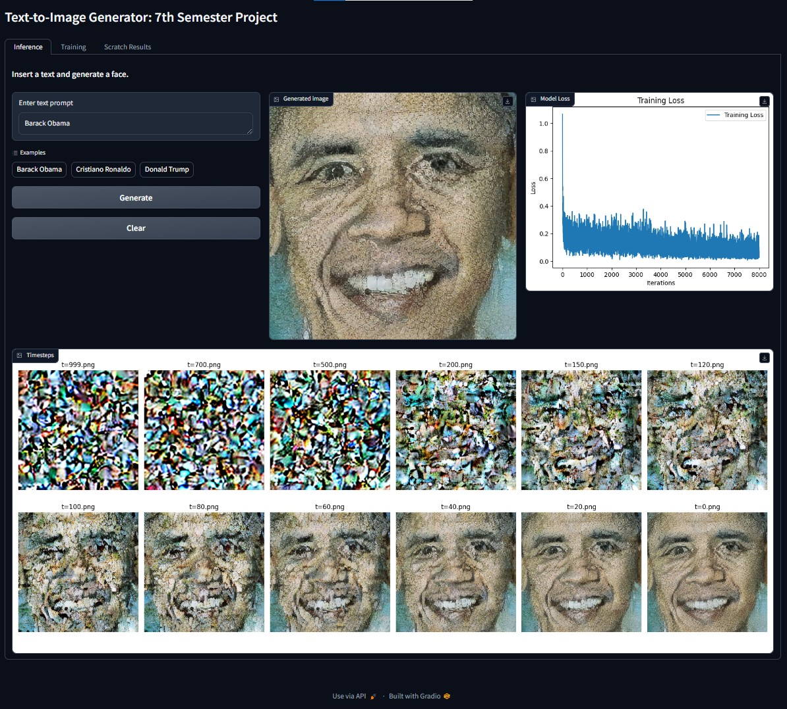
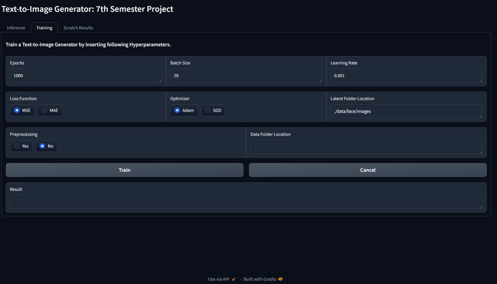

# Text-to-Image Generator

A final year project of BSc. CSIT, based on paper "High-Resolution Image Synthesis with Latent Diffusion Models": https://arxiv.org/pdf/2112.10752.pdf.

## Abstract

The “Text-to-Image generator” presents an innovative approach to synthesize visual content from textual descriptions. Leveraging the power of LDMs, the system employs a novel iterative process to refine a latent representation space, enabling the generation of high-quality images from diverse textual prompts. The project aims to provide users with a versatile tool for creative expression, educational illustration, and efficient content creation by combining the strengths of latent diffusion models and convolutional neural networks in a unified framework.  This project uses advanced Generative AI techniques like the diffusion model, UNet, and Variational Autoencoder to generate visual outputs. 

The project's core focus lies in image generation, where textual prompts act as creative guides the generation process. By incorporating the diffusion model, the system undergoes a refined process of noise reduction in a latent space, resulting in the production of images. Variational Auto-encoders used for latent image manipulation and UNet is used for prediction of noise. Through iterative Markov process, an image is generated.

The implementation employs the PyTorch framework along with the Diffusers library ensuring a flexible and efficient development environment. These frameworks provide specialized toolkit for managing the diffusion process, optimizing performance, and enhancing the overall stability of the image generation pipeline.

## Screenshots

### Inference

### Training Tab

